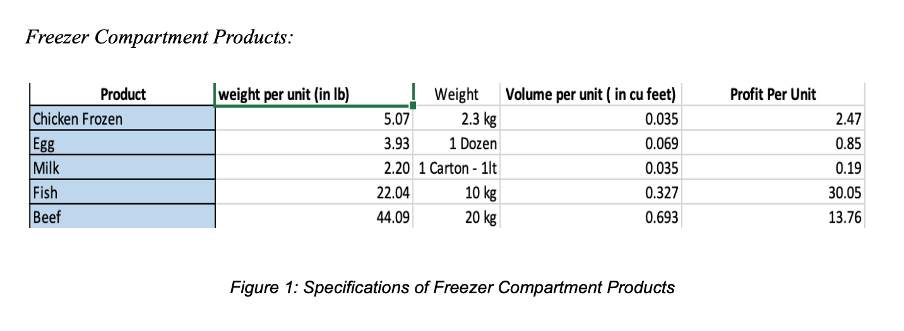
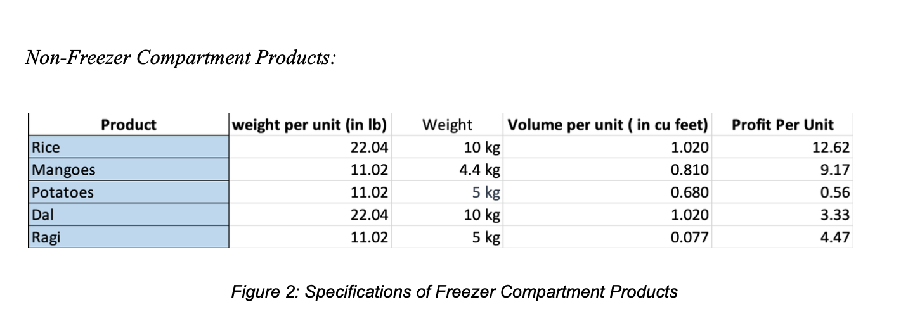
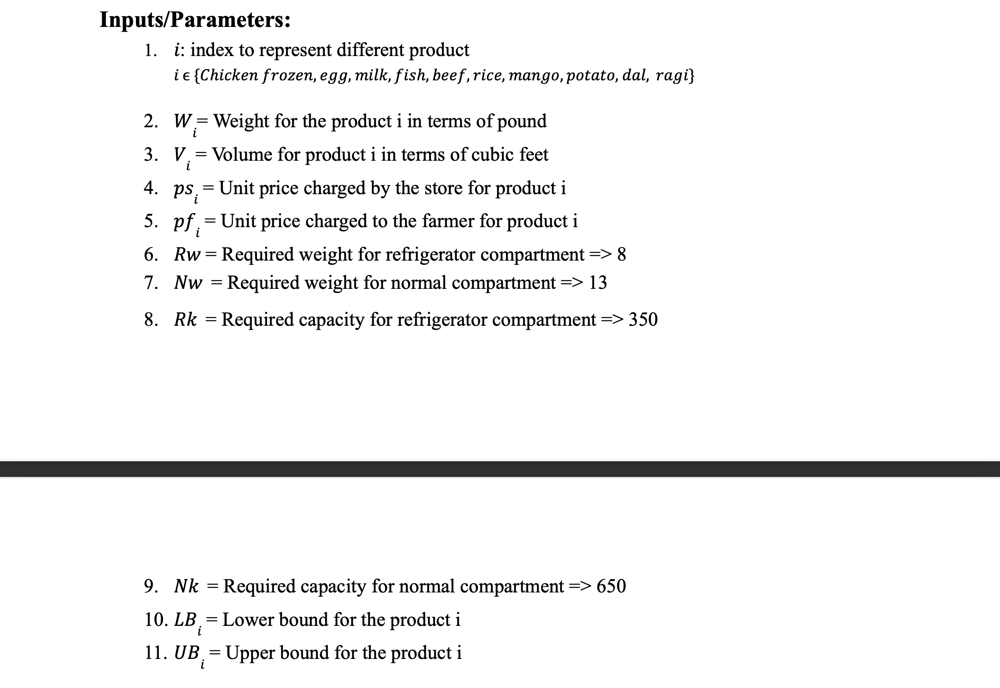
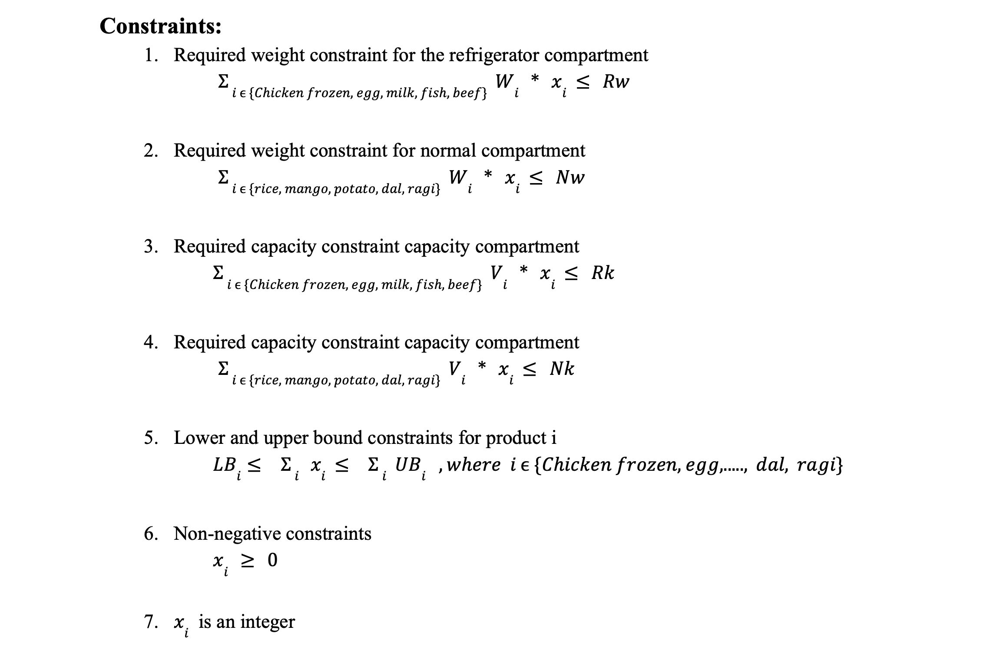

# 🚜 Analytical Decision Modeling Project: Optimizing Farm-to-Market Logistics in India 🌾

## 📝 Overview
This project focuses on **enhancing farm-to-market connectivity** in India by optimizing logistics for a burgeoning agricultural distribution company. Using **Excel Solver's linear modeling approach**, the project maximizes profitability and space utilization within a **TATA TAURUS truck** while adhering to weight and volume constraints for transporting various agricultural products. This solution aims to support **small-scale local farmers** by connecting them to larger markets more effectively.

---

## 📍 Background: Bridging Agriculture & Logistics
Our logistics startup is dedicated to:
- **Empowering Local Farmers**: Ensuring profitable access to urban markets.
- **Reducing Transit Time**: Speeding up transport to maintain freshness.
- **Promoting Sustainability**: Reducing the carbon footprint through optimized routes.

---

## 📊 Figures

_Figure 1: Specifications of Freezer Compartment Products_

_Figure 2: Specifications of Non-Freezer Compartment Products_

---

## 🔍 Problem Statement
We aim to maximize profit by determining the optimal product mix in both freezer and non-freezer compartments, given weight and volume constraints. The objective is to:
1. Maximize Profit
2. Efficiently utilize available space.
3. Maintain product quality standards.

---

## 🚛 Truck Specifications: TATA TAURUS
- **Max Load Capacity**: 21 tons
- **Storage Compartments**: Freezer and Non-Freezer sections
- **Operational Efficiency**: Enables temperature control for diverse products

---

## 📊 Mathematical Model
### **Inputs and Parameters**

  
### **Objective**:  
Maximize profit:  

### **Constraints**:
1. Weight constraints for Freezer and Non-Freezer compartments.
2. Volume limits for each compartment.
3. Bounds for each product type.

---

## 💼 Business Approach
### 1. **Building Sustainable Partnerships**
   - Direct collaboration with local farmers to source fresh produce, enhancing product freshness and supporting the local economy.
   
### 2. **Optimized Linear Modeling**
   - An Excel Solver model focusing on maximizing profitability while managing transport constraints.

### 3. **Managing Storage Constraints**
   - Ensures integrity of products with distinct constraints for freezer and non-freezer goods.

---

## 🔧 Solver Approach & Methodology
Utilizing **Excel's linear solver**, we input constraints for weight and volume, defining product boundaries to maximize profit and space efficiency. This approach balances the weight and volume while aiming to fill the truck with profitable goods.

---

## 📈 Key Recommendations
1. **Optimize Specific Products**: Deliver more fish, mangoes, and ragi based on model insights.
2. **Integrate Optimization Model**: Continuously update the model with real-time data to adapt to market changes.
3. **Expand Market Reach**: Explore wholesale retailer partnerships in areas lacking access to specialty products.

